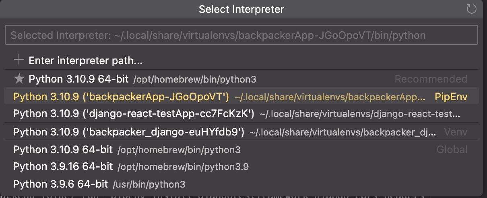

# Adventure Atlas

## Description

Adventure Atlas is an application for publishing your very own backpacking adventures, exploring others backpacking adventures and interact with members of the world!

# Developer info

## Frontend testing - Cypress

To run, go to frontend directory and in terminal write `npx cypress open`
From there go to E2E testing and so on. Enter "specs". These are the tests. From there it should be pretty straight forward.
If any tests fail, either the code is wrong, or the test is wrong, or the test cannot access the component based on the provided "aria-label". The `cy.getByLabel` command finds the component with the given aria-label.

# Development setup

---

**Co-authors**

-   Alex Makassiouk (alexmak@stud.ntnu.no)
-   Ian Aksum
-   Mads Hermansen

---

The following article has been used for the setup:

-   [React Django and Rest Framework](https://www.section.io/engineering-education/react-and-django-rest-framework/)

-   The setup was done with following variables:
    -   PC: Macbook Pro 16' 2021 M1 pro with Ventura 13.0.1
    -   vscode: 1.75.0
    -   python: 3.10.9

## For ALL group members: Backend

### Step 1 - Prerequisites

1. If no Python $\rightarrow$ install Python 3
2. Check Python version:
    1. In terminal:
    2. `python3 --version` or `python --version`
    3. Should be at least Python 3.10
3. Install node:
    1. https://nodejs.org/en/download/
4. Check node version:
    1. In terminal:
    2. `node --version`
    3. Should be something like v19.4.0

### Step 2 - Environment and Django installation

1. Change directory into project with:
    1. `cd Documents/backpackerApp`
    2. Change above path to your path on your computer
2. Run `pip install pipenv`
3. Run `pipenv shell`
4. Run `pipenv install django`
5. Check Django version
    1. `python3 -m django --version`
    2. Should be something like 4.1.6

### Step 3 - Run server

1. `cd backend`
2. `python3 manage.py runserver`

3. In browser, go to localhost:8000/admin
    1. enter "gruppe59" as username
    2. enter "gruppe59PU" as password
4. Try localhost:8000/api/routes as well to see stored routes in database
5. To stop server press control + c, but for now let server run

### Step 4 - REST API stuff

-   Note: If server is running: open a new terminal window in VS code with the '+' sign

1.  in upper backend folder run `pipenv install djangorestframework django-cors-headers`
2.  Make sure your local environment is still active. In terminal the start of line should be "(backpackerApp)". If not running run `pipenv shell`

## For ALL group members: Frontend

### Step 1 - Check that frontend is running

1. `cd frontend`
2. `npm install`
3. `npm start`
4. Hopefully welcome to our frontend at localhost:3000 !

## Some potential environment fixes

-   Make sure vscode is running in the virtual environment:
    -   cmd+shift+p
    -   "Python: select interpreter"
    -   select the backpackerApp virtual environment
    -   

# Git conventions

## Issues and branches

Make a branch for each issue. When finished create merge request in GitLab and request peer reviews from other group members. See the following section for branch name conventions.

## Branch name conventions

First specify if branch is working on a new feature with 'feat' or a 'bug'. Then include a dash and the issue number, and then another dash and the 'branch title' in kebab-case. Should be something like:

`feat-31-travelroute-overview-page`
`bug-31-{name or description}`
